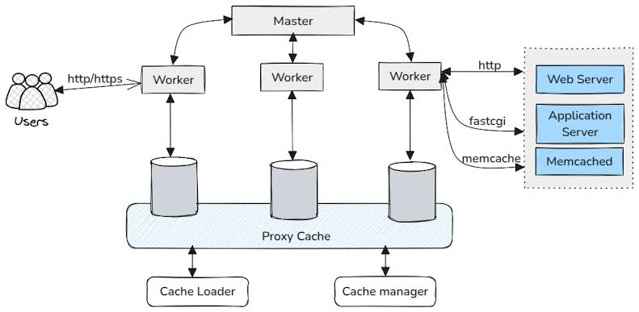
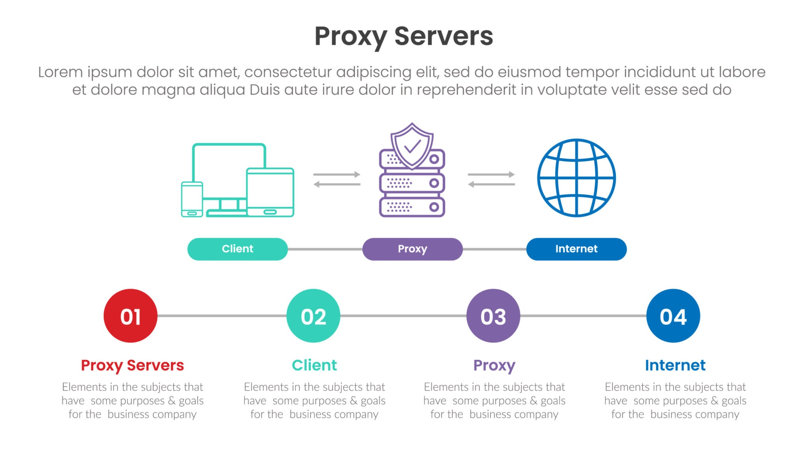
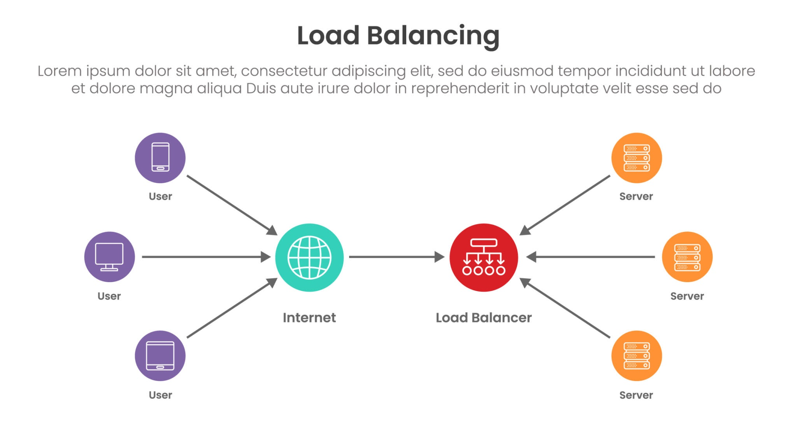
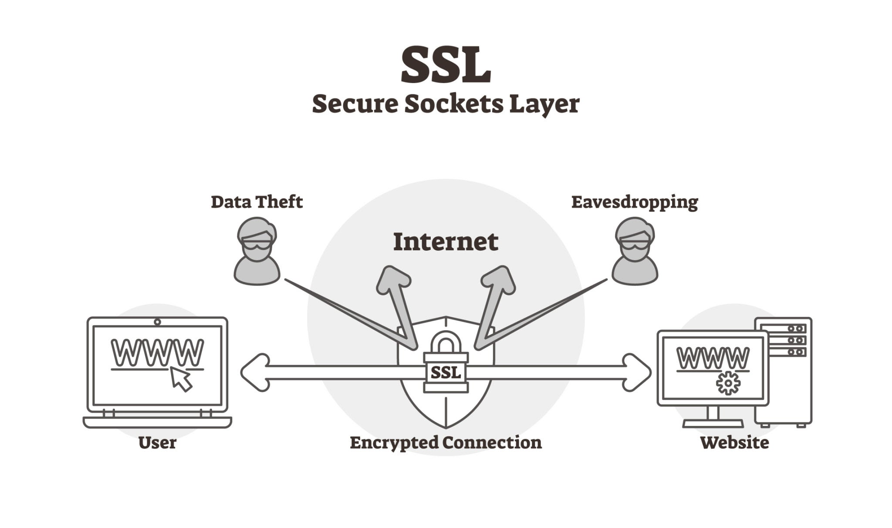

# Nginx

## Mimari ve Temel Mantık

### Nginx Nedir?

En basit haliyle Nginx, sunucunun kapısında duran inanılmaz hızlı ve yetenekli bir karşılama görevlisi veya resepsiyonisttir.

Bir web sitesine veya uygulamaya tarayıcıdan istek geldiğinde, bu isteği ilk karşılayan Nginx'tir. Arka plandaki asıl uygulamanın (Node.js, Python, PHP vb.) gereksiz yere yorulmasını ve çökmesini engeller.

Yüksek performanslı bir web sunucusu, reverse proxy ve yük dengeleyicidir (load balancer).

Çıkış noktası ve asıl ünü, C10K problemini (tek bir sunucuda aynı anda 10.000 bağlantıyı idare edebilme) çözmesinden gelir.

### Nginx'ten Önce Ne Vardı?

**Apache HTTP Server:** 90'ların sonu ve 2000'lerin başında internetin mutlak hakimiydi. Ancak Apache, her yeni ziyaretçi için sunucuda yeni bir işlem açma mantığıyla çalışıyordu.

**C10K Problemi:** 2000'li yıllarda internet kullanımı patlayıp sitelere aynı anda 10.000 kişi (C10K - 10K Concurrent) bağlanmaya başlayınca, Apache'nin bu yapısı sunucuların RAM'ini sömürüp sistemleri çökertmeye başladı. Donanım yetmemeye başladı.

**Nginx'in Doğuşu (2004):** Rus geliştirici Igor Sysoev, bu sorunu çözmek için Nginx'i yazdı. Event-Driven (Olay Güdümlü) asenkron yapı sayesinde, standart bir sunucu ile 10 binlerce kişiye çökmeden yanıt verebildi ve performans standardını tamamen değiştirdi.

|Alternatif|Öne Çıkan Özelliği|Neden Tercih Edilir?|Nginx ile Temel Farkı|
|---|---|---|---|
|Apache|.htaccess desteği ve modüler yapı|Geleneksel paylaşımlı hostingler (cPanel vb.) için hala vazgeçilmezdir. Ayarların klasör bazında kolayca ezilmesine olanak tanır.|Nginx statik dosyalarda ve anlık yüksek trafikte çok daha hızlıdır. Apache ise her istek için yeni bir süreç/iş parçacığı başlattığından yoğun yük altında Nginx kadar verimli değildir.|
|Caddy|Otomatik SSL ve minimal konfigürasyon|Yeni neslin favorisidir. Nginx'te manuel yapılan HTTPS/Sertifika ayarlarını otomatik halleder. Konfigürasyon dosyası Nginx'in onda biri kadardır.|Nginx'in yapılandırması detaylı ve uzundur, SSL için Let's Encrypt (Certbot) gibi dış araçlar kurmayı gerektirir. Caddy ise SSL'i kendisi alır ve yeniler. Ancak Nginx'in modül ekosistemi ve topluluğu çok daha büyüktür.|
|Traefik|Konteyner (Docker/Kubernetes) dostu|Mikroservisler için biçilmiş kaftandır. Sisteme yeni bir Docker ayağa kalktığında Traefik bunu otomatik tanır, Nginx gibi ayar dosyasını manuel güncellemeye gerek kalmaz.|Nginx statik ayar dosyalarıyla çalışır, arkaya yeni bir uygulama eklendiğinde dosyayı düzenleyip Nginx'e "reload" atmak gerekir. Traefik ise arkadaki değişiklikleri anlık olarak algılayıp trafiği kesintisiz yönlendirir.|
|HAProxy|Saf Yük Dengeleme (Load Balancing)|Nginx gibi statik dosya (HTML/CSS) sunmaz, sadece trafiği dağıtmaya odaklanır.|Nginx web sunucusu işini de yapar, HAProxy yapmaz. Saf yük dengeleme algoritmalarında ve sunucu sağlık kontrollerinde (health checks) ücretsiz Nginx'ten çok daha yetenekli ve incedir.|
|Envoy|Bulut tabanlı (Cloud-native) mimari|Özellikle Kubernetes ortamlarında (Service Mesh) Nginx'in yerini almaya başlayan, mikroservisler arası iletişimi yöneten modern C++ tabanlı vekildir.|Nginx genellikle dışarıdan gelen isteği karşılayan ana kapı (Edge Proxy) olarak kullanılırken, Envoy daha çok sistemin içindeki onlarca uygulamanın kendi aralarındaki devasa veri trafiğini yönetmek için tercih edilir.|

### Event-Driven Mimari
Nginx'i standart haline getiren temel özellik, gelen bağlantıları ele alış biçimidir:

**Geleneksel Model (Thread-Based):** Eski nesil web sunucuları her yeni kullanıcı bağlantısı için yeni bir thread oluşturur. Trafik arttıkça RAM ve CPU tüketimi hızla şişer, sunucu tıkanır.

**Nginx Modeli (Asenkron ve Non-blocking):** Nginx her bağlantı için yeni işlem başlatmaz. Bunun yerine, az sayıda işlemle binlerce bağlantıyı bir "olay döngüsü" (event loop) üzerinden yönetir. Bekleme gerektiren bir işlem olduğunda sistemi kitlemez, o sırada başka bir kullanıcının isteğini yanıtlar.

**Sonuç:** Çok düşük RAM tüketimi ile devasa trafikleri eritebilme gücü.

### Process Hiyerarşisi
Nginx arka planda iki temel yapıyla çalışır:

**Master Process:** Patron görevindedir. Konfigürasyon dosyalarını okur ve Worker süreçlerini başlatıp yönetir. Kullanıcılardan gelen ağ istekleriyle doğrudan ilgilenmez.

**Worker Process:** Gerçek işi yapan, istemcilerden gelen istekleri karşılayıp yanıtlayan mekanizmadır. Verimi maksimize etmek için genellikle sunucudaki her CPU çekirdeği başına 1 Worker Process atanır.

  

## Konfigürasyon Anatomisi

**nginx.conf (Ana Yönetim Merkezi)**

- İşlevi: Nginx'in kalbi ve beynidir. Tüm sistemi etkileyen global ayarlar burada barındırılır.

- İçeriği: Kaç adet Worker Process çalışacağı, genel güvenlik kuralları, bağlantı limitleri ve en önemlisi diğer parçalı ayar dosyalarını sisteme dahil eden include komutları bu dosyada yer alır.

**sites-available Klasörü (Bekleme Odası / Depo)**

- İşlevi: Sunucuda barındırmak istenilen her bir farklı web sitesi veya uygulama (Domain A, Domain B vb.) için oluşturulan özel ayar dosyalarının saklandığı yerdir.

- Özelliği: Nginx bu klasörü doğrudan okumaz. Buraya bir dosya koyulması, sitenin anında yayına gireceği anlamına gelmez. Pasif bir arşiv alanıdır.

**sites-enabled Klasörü (Vitrin / Aktif Alan)**

- İşlevi: Sadece aktif olarak yayında olan sitelerin bulunduğu yerdir. Nginx başlarken sadece bu klasörün içindekileri okur.

- Çalışma Mantığı (Symlink): Dosyaların orijinalleri bu klasöre kopyalanmaz. Bunun yerine, sites-available içindeki orijinal dosyaya işaret eden bir kısayol (symlink) oluşturulur.

**Bu Hiyerarşinin Sağladığı Avantaj:**
Bir site geçici olarak kapatılmak veya bakıma alınmak istendiğinde, uzun ayar dosyalarını silmeye gerek kalmaz. Sadece sites-enabled (vitrin) içindeki kısayol silinir ve Nginx'e ayarlar yeniden okutulur. Sitenin asıl ayarları sites-available içinde dokunulmamış halde kalır. Site geri açılmak istendiğinde kısayolu tekrar oluşturmak yeterlidir.

## Bloklar (Contexts)

**http Bloğu (Ana Kapsayıcı)**

- Nginx'in web ile ilgili tüm işlemlerini kapsayan en dış çerçevedir.

- Log formatları, dosya sıkıştırma ayarları gibi tüm siteleri etkileyecek genel kurallar burada tanımlanır. Sistemdeki bütün web siteleri bu bloğun kurallarına tabidir.

**server Bloğu (Virtual Host)**

- http bloğunun içinde yer alır. Kiralanan sunucudaki her bir farklı web sitesini veya uygulamayı temsil eder.

- Hangi domain'e ve hangi porta yanıt verileceği burada, `server_name` ve `listen` komutlarıyla belirlenir.

- Aynı sunucuda 3 farklı site varsa, bu bloğun içine yazılmış 3 farklı server bloğu var demektir. Nginx gelen isteğin domainine bakar ve doğru server bloğunu seçer.

**location Bloğu (URL Yönlendirici)**

- server bloğunun içinde yer alır. İşin en detaylı, milimetrik ayarlarının yapıldığı yerdir.

- Kullanıcının girdiği URL yoluna göre ne yapılacağına karar verir.

- Örneğin; `/ (ana sayfa)` isteği geldiğinde Node.js'e git, `/resimler` isteği geldiğinde arka plana gitme doğrudan şu klasördeki resimleri göster gibi spesifik yönlendirmeler bu blokların içine yazılır.

## Reverse Proxy

**Forward Proxy:** Kullanıcıyı (istemciyi) gizler ve korur. Örneğin VPN bir Forward Proxy'dir. İnternetteki bir siteye girildiğinde istek önce VPN sunucusuna yollanır, siteye kullanıcı yerine o girer ve sonucu getirir. Karşıdaki web sitesi kullanıcının kim olduğunu (gerçek IP'yi) bilmez, sadece VPN sunucusunu görür.

**Reverse Proxy:** Sunucuyu gizler ve korur, Nginx budur. Dışarıdaki kullanıcılar siteye girerken doğrudan Node.js veya Python uygulamasına  ulaşamaz. İsteği Nginx karşılar, arka taraftaki uygulamaya kendi sorar, cevabı alıp kullanıcıya iletir. Kullanıcı arka planda hangi teknolojinin veya hangi portun çalıştığını asla bilmez, sadece Nginx'i görür.

  

### Reverse Proxy Olarak Nginx

Eğer kullanıcı sitedeki bir logoyu (logo.png) görmek istiyorsa, bu isteği asıl uygulamaya kadar götürmek büyük bir performans israfıdır. Nginx, diskteki dosyaları okuyup doğrudan ağ kartına iletme konusunda inanılmaz optimize edilmiştir. Statik dosyalar Nginx üzerinden sunulduğunda, uygulama gereksiz yere yorulmaz ve sadece asıl yapması gereken işlere odaklanır. Fakat kullanıcı veritabanı sorgusu gerektiren dinamik bir şey isterse o zaman Nginx topu arka plandaki asıl uygulamaya atar.

**Temel Mekanizma:**
Nginx, location bloğu içerisine yazılan `proxy_pass` komutu ile bu yönlendirmeyi yapar.
Örneğin Nginx'e dışarıdan `/api` ile başlayan bir istek gelirse, buna cevap vermez, bu isteği alır ve sunucunun kendi içindeki http://localhost:3000 adresine fırlatır.

### Başlıkları (Headers) Taşımak
Nginx arka plandaki uygulama ile konuşurken bir problem ortaya çıkar. Arka plan uygulamasına soruyu bizzat Nginx sorduğu için uygulama gelen bütün isteklerin kaynağını Nginx'in IP adresi (genellikle 127.0.0.1 - localhost) olarak görür. Gerçek kullanıcının IP adresini bilemez (bu da loglama veya IP banlama gibi güvenlik önlemlerini engeller).

Bunu çözmek için Nginx'te `proxy_set_header` komutları kullanılır. Nginx, isteği arka plana fırlatırken gerçek kullanıcının IP adresini ve tarayıcı bilgilerini bir HTTP Headers'a koyarak arka plandaki uygulamaya iletir. Böylece uygulama (hangi dilde yazılmış olursa olsun) aslında kiminle muhatap olduğunu bilir.

## Load Balancing

**Amacı:** Siteye gelen ziyaretçi sayısı tek bir uygulamanın veya sunucunun kaldıramayacağı kadar arttığında, aynı uygulamanın kopyaları farklı portlarda veya tamamen farklı sunucularda çalıştırılır. Nginx, kapıya yığılan bu trafiği arka plandaki bu kopyalar arasında paylaştırır. Sistem hem hızlanır hem de sunuculardan biri çökse bile Nginx trafiği diğerlerine kaydırarak sitenin ayakta kalmasını sağlar.

**Çalışma Mantığı (upstream Bloğu):** Nginx ayarlarında bir upstream (kaynak) bloğu tanımlanır. Bu blok, arka plandaki sunucuların bir listesidir. Ardından `proxy_pass` komutu tek bir IP veya porta değil, doğrudan bu upstream grubunun ismine yönlendirilir.

  

### Yük Dağıtım Algoritmaları
Nginx'in trafiği dağıtırken kullandığı temel stratejiler şunlardır:

**Round Robin (Varsayılan):** İskambil kağıdı dağıtır gibi sırayla verir. Birinci istek A sunucusuna, ikinci istek B'ye, üçüncü istek C'ye gider ve sonra tekrar başa döner.

**Least Connections (least_conn):** Hangi sunucunun o an en az aktif bağlantısı varsa, yeni gelen isteği ona yönlendirir. Bazı işlemlerin uzun, bazılarının kısa sürdüğü sistemler için dengeli bir yöntemdir.

**IP Hash (ip_hash):** Aynı IP adresine sahip bir kullanıcı siteye her girdiğinde hep aynı arka plan sunucusuna yönlendirilir. (Örneğin sepet veya kullanıcı giriş verileri ortak bir veritabanında değil de uygulamanın kendi belleğinde tutuluyorsa, kullanıcının hep aynı sunucuya düşmesi gerekir; aksi halde hesaptan çıkış yapmış gibi görünür).

**Weight:** Arka plandaki sunucuların donanımları eşit değilse kullanılır. B sunucusunun işlemcisi daha güçlüyse, oraya A sunucusunun 2 katı trafik gönderen manuel bir oran belirlenmesini sağlar.

## Güvenlik ve SSL/TLS

Amacı kullanıcının tarayıcısı ile sunucu arasındaki trafiği şifrelemektir. Nginx bu aşamada şifreleme ve şifre çözme işlemini üstlenerek arka plandaki uygulamaları büyük bir yükten kurtarır.

İnternetten gelen şifreli istek Nginx'e ulaşır. Nginx şifreyi çözer ve uygulamaya şifresiz, düz bir HTTP isteği olarak yollar. Uygulama cevabı düz HTTP olarak Nginx'e verir, Nginx bunu tekrar şifreleyip internete yollar. Böylece arka plan uygulaması kriptografi matematiğiyle uğraşmaz.

  

Nginx'te güvenli bir bağlantı kurarken genellikle şu iki kural uygulanır:

- HTTP'yi HTTPS'e Zorlama: Eski usul güvensiz port olan 80'e (HTTP) gelen tüm istekler yakalanır ve anında güvenli porta (443) yönlendirilir. Kullanıcı `http://` yazsa bile Nginx onu zorla `https://` adresine atar.

- Sertifika Tanımlamaları: Nginx'in gelen şifreli bağlantıları karşıladığı asıl porttur. Şifrelemenin çalışması için server bloğunun içinde iki kritik dosyanın yeri belirtilir:
    - ssl_certificate (Public Key): Ziyaretçilere gönderilen ve onların göndereceği verilerin şifrelenmesini sağlayan kimlik belgesidir.

    - ssl_certificate_key (Private Key): Nginx'in elinde tuttuğu, ziyaretçilerden gelen şifreli verilerin çözülmesini sağlayan gizli dosyadır.

## Gözlem ve Loglama

Amaç sistemde ne olup bittiğini görmek, hataları ayıklamak ve siteye gelen trafiği analiz etmektir. Nginx, kapıdan giren çıkan herkesi ve yaşanan tüm krizleri iki temel dosya üzerinden raporlar:

- **access.log (Giriş/Erişim Kayıtları):** Sunucuya gelen her bir isteğin satır satır kaydedildiği dosyadır. "Hangi IP adresi, saat kaçta, hangi sayfayı veya dosyayı istedi, yanıt olarak hangi HTTP kodunu aldı, tarayıcısı ve işletim sistemi neydi?" gibi istatistiksel bilgilerin tümü burada tutulur.

- **error.log (Hata Kayıtları):** Nginx'in çalışırken karşılaştığı yapısal sorunların ve en önemlisi arka plan uygulamasıyla yaşadığı iletişim kopukluklarının yazıldığı cankurtaran dosyasıdır. Örneğin; uygulama çöktüyse ve Nginx ona ulaşamıyorsa, ziyaretçiye "502 Bad Gateway" hatası gösterilir ve bunun teknik detayı anında bu dosyaya yazılır. Sorun çözerken ilk bakılacak yerdir.

### Log Yönetimi ve Özelleştirme

**Log Formatını Değiştirme:** http bloğu içinde özel log formatı oluşturulabilir. Vekilleri aşıp gelen "gerçek kullanıcı IP'sini" loglara yazdırmak bu şekilde mümkün olur.

**Gereksiz Logları Kapatma:** Bir web sitesinde yüzlerce resim, CSS ve font dosyası olabilir. Her bir resim yüklendiğinde bunun `access.log` dosyasına yazılması diski çok hızlı doldurur ve sunucuyu yorar. Nginx'te location blokları içine `access_log off`; komutu yazılarak, sadece statik dosyaların loglanması kolayca iptal edilebilir.

