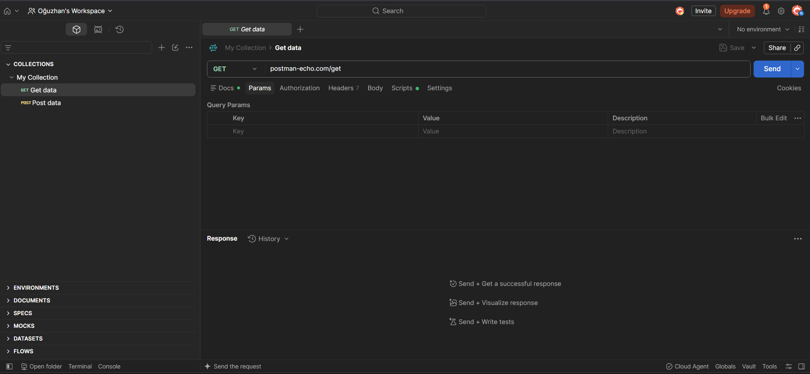
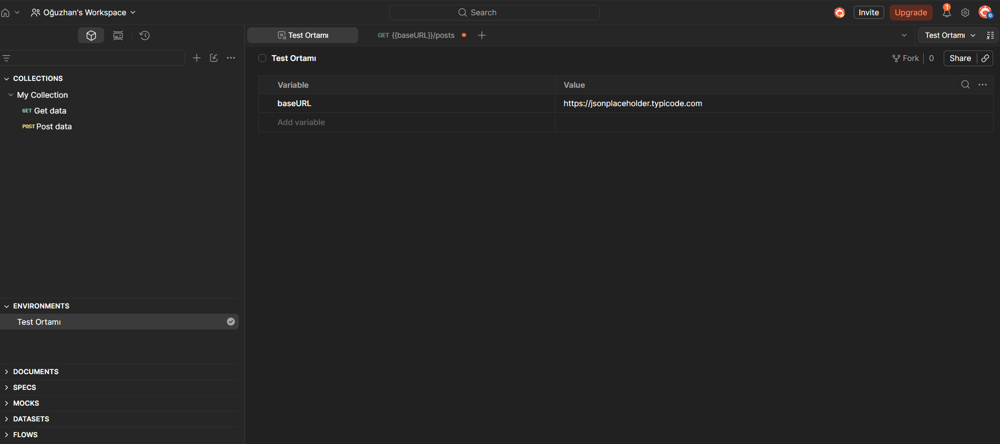
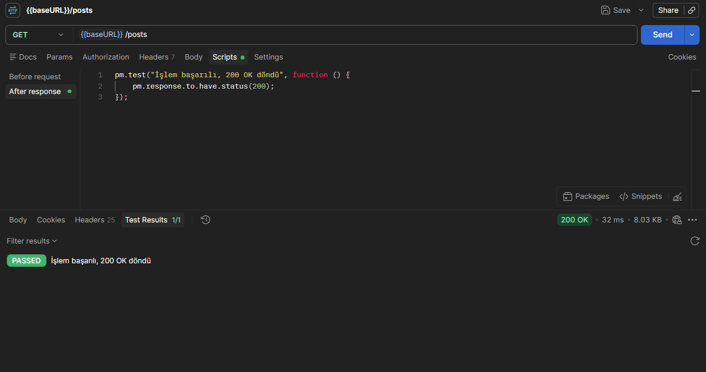

# RestAPI ve Postman

## Teori ve Temeller

REST (Representational State Transfer), sistemlerin internet üzerinden birbirleriyle nasıl anlaşacağını belirleyen bir mimari standarttır. API (Application Programming Interface) ise bu standardı kullanarak iletişimi sağlayan köprüdür.

### Adres ve Yön Bulma: Base URL, Endpoint ve Path

REST API'de her şey bir kaynağı işaret eder ve bu kaynaklara web URL'leri üzerinden ulaşılır.

- Base URL: API'nin internetteki ana adresidir. İstek atarken bu kısım genelde sabittir. (Örn: [https://api.github.com](https://api.github.com))

- Endpoint: Ana adrese eklenen ve belirli bir kaynağa giden spesifik yoldur. (Örn: /users)

- Path Variable: URL'nin içine gömülen, genellikle bir ID olan değişkendir. Hangi spesifik verinin istendiğini belirtir. (Örn: /users/torvalds rotasındaki torvalds bir değişkendir).

### HTTP Metotları

|Metot|İşlev|
|---|---|
|GET|Sunucudan sadece veri okur/getirir.|
|POST|Sunucuda yeni bir veri/kayıt oluşturur.|
|PUT|Mevcut bir veriyi tamamen günceller.|
|PATCH|Mevcut verinin sadece bir kısmını günceller.|
|DELETE|Belirtilen veriyi sunucudan siler.|

### HTTP Durum Kodları

Bir istek (Request) atıldığında, sunucu bir cevap (Response) döner. Bu cevabın durumu sayılarla ifade edilir.

|Kod|Anlamı|Kategori|
|---|---|---|
|200 OK|İstek başarılı, istenen işlem gerçekleşti veya veri döndü.|Başarılı (2xx)|
|201 Created|İstek başarılı ve sunucuda yeni bir kayıt oluştu.|Başarılı (2xx)|
|400 Bad Request|Gönderilen istekte veya veride hata var.|İstemci Hatası (4xx)|
|401 Unauthorized|Kimlik doğrulaması eksik.|İstemci Hatası (4xx)|
|404 Not Found|Ulaşmaya çalışılan adres veya veri bulunamadı.|İstemci Hatası (4xx)|
|500 Internal Server Error|Karşı sunucu çöktü.|Sunucu Hatası (5xx)|

> Bu metotlar ve dönen cevap kodları, Postman'da işlem yaparken kullanılacak.

## Verinin Dili: JSON

JSON (JavaScript Object Notation), sistemler arasında veri taşımak için kullanılan en popüler, hafif ve insanların da rahatça okuyabileceği metin tabanlı bir formattır. Temelde bir kargo paketine benzer, verileri düzenli bir standartta kutulayıp karşı tarafa hatasız göndermeyi sağlar.

### Key-Value Mantığı

JSON'da her şey "Anahtar" (Key) ve "Değer" (Value) eşleşmeleriyle yazılır.

```JSON
{
  "kullaniciAdi": "ahmet_yilmaz",
  "yas": 28,
  "aktifMi": true,
  "kullandigiAraclar": ["Postman", "Swagger", "VS Code"],
  "adres": {
    "sehir": "Erzurum",
    "postaKodu": 25000
  }
}
```
- Süslü Parantezler { }: Bir nesneyi (object) temsil eder. Her JSON paketi genelde bununla başlar ve biter.

- Köşeli Parantezler [ ]: Birden fazla veriyi tutan listeleri (array) belirtir.

- Veri Tipleri: Metinler mutlaka çift tırnak (" ") içinde yazılır. Sayılar ve mantıksal değerler (true/false) tırnaksız yazılır.

#### Request Body (İstek Gövdesi)

Sunucuya yeni bir veri göndermek veya mevcut veri güncellenmek istendiğinde (POST, PUT, PATCH metotları), bu veri URL'nin içine sığdırılamaz. Bunun yerine, gönderilecek bilgiler bir JSON formatında hazırlanıp istenilen "Body" (gövde) kısmına eklenir. Sisteme kayıt olan yeni bir kullanıcının form verilerini yollamak tam olarak budur.

#### Response Body (Cevap Gövdesi)

Sunucuya bir istek attıktan sonra, sunucunun döndürdüğü paketlenmiş veridir. Başarılı bir istekte 200 OK durum koduyla birlikte ekranda görülecek veri bloğu tam olarak Response Body'dir.


## Postman Kurulumu ve Arayüz

Postman kendi sitesi olan [postman.com](https://www.postman.com/) adresinden masaüstü uygulaması olarak indirilebilir veya doğrudan tarayıcı üzerinden ücretsiz bir hesap açarak kullanılabilir. Arayüze girildiğinde sol ve orta panelde şunlar görünür:

<p align="center">
  
</p>

- Workspace (Çalışma Alanı): Dijital çalışma masasıdır. Farklı projeleri birbirine karıştırmamak için ayrı Workspace'ler açılabilir.

- Collection (Koleksiyon): İlgili API isteklerini bir arada tutan ana klasörlerdir. Yapılan bir istek kaydedilip tekrar kullanılmak isteniyorsa mutlaka bir Collection içine kaydedilmelidir.

- Folder (Alt Klasör): Collection içindeki verileri daha da düzenli tutmak içindir.

- Request Bar (İstek Çubuğu): Ekranın ortasında yer alan alandır. Sol tarafında bir açılır menü (GET, POST vb. seçmek için) ve yanında URL'nin yapıştırılacağı uzun bir çubuk bulunur.

- Send Butonu: İsteği sunucuya fırlatan mavi butondur.

- Response (Cevap) Ekranı: Ekranın alt yarısıdır. "Send" tuşuna bastıktan sonra sunucudan dönen JSON verisi ve (200 OK, 404 Not Found gibi) durum kodunu burada gözükür.

### Temel Çalışma Döngüsü

Postman'da bir işlem yaparken izlenecek standart döngü her zaman şudur: Sol panelden "+" butonuna basılıp yeni bir Request (İstek) açılır, metot seçilir, URL girilir, gerekiyorsa (POST yapılıyorsa) orta bölümdeki "Body" sekmesine geçip JSON verisi yazılır ve Send'e basılır.

## İlk İsteği Atma

Testler için geliştiricilerin kum havuzu olan ücretsiz **JSONPlaceholder** servisini kullanarak ilk GET ve POST isteklerini oluşturma:

#### **Senaryo 1: GET İsteği ile Veri Çekmek**

Amaç: Sistemdeki 1 numaralı makaleyi (post) okumak.

- İsteği Hazırlamak:
    Sol üstteki menüden metodu GET olarak bırak. URL çubuğuna:
    [https://jsonplaceholder.typicode.com/posts/1](https://jsonplaceholder.typicode.com/posts/1)

- Göndermek ve İncelemek:
    Mavi Send butonuna basınca alt kısımdaki Response (Cevap) ekranında durum kodunun 200 OK olduğu ve 1 numaralı makalenin JSON formatında geldiği görülür.

<p align="center">
  
</p>

#### **Senaryo 2: POST İsteği ile Yeni Veri Göndermek**

Amaç: Sunucuya kendi yazdığımız yeni bir makaleyi kaydetmek.

- Metot ve URL Ayarı:
    Yeni bir sekme aç, metodu POST yap. URL çubuğuna:
    [https://jsonplaceholder.typicode.com/posts](https://jsonplaceholder.typicode.com/posts)

- Body (Gövde) Hazırlığı:
    URL'nin altındaki konfigürasyon sekmelerinden Body'ye tıkla. Altından raw (ham veri) seçeneğini işaretle. Sağ tarafta beliren "Text" açılır menüsünü JSON olarak değiştir.

- JSON Verisini Girmek:
    Açılan metin kutusuna şu veri paketini yapıştır:
    ```JSON
    {
        "title": "Postman Öğreniyorum",
        "body": "Adım adım REST API testleri yapıyoruz.",
        "userId": 1
    }
    ```

- Sonucu Gözlemlemek:
    Send butonuna basılınca Response ekranında durum kodunun bu kez 201 Created (Başarıyla Oluşturuldu) olduğu görülür. Sunucu, gönderilen veriyi kabul ettiğini ve ona otomatik olarak "101" ID'sini atadığını belirten bir cevap gövdesi döndürür.

<p align="center">
  
</p>

> Not: Metin tabanlı veriler için `raw` formatı kullanılır ancak sunucuya bir profil fotoğrafı, PDF veya herhangi bir dosya yüklenmek istendiğinde, Body sekmesinde `raw` yerine `form-data` seçeneğini işaretlemek gerekir.

#### **Senaryo 3: Query Params (Sorgu Parametreleri) ile Filtreleme**

Amaç: Bazen tüm veriler değil, belirli bir filtreye uyanlar istenebilir.

- Metodu tekrar GET yap ve URL çubuğuna:
    [https://jsonplaceholder.typicode.com/posts](https://jsonplaceholder.typicode.com/posts)

- Params Sekmesine Gel
    Key sütununa userID, Value sütununa 1 yaz.

- URL'nin Güncellenmesi
    Otomatik olarak URL sonuna soru işareti alıp `.../posts?userID=1` şeklinde güncellenir. Send'e basıldığında liste filtrelenmiş olarak gelir.

<p align="center">
  
</p>

```
Tüm bu işlemler sırasında REST API, Postman ile karşı sunucu (JSONPlaceholder) arasındaki görünmez köprü ve kurallar bütünüdür.

- URL'ye yazılan adres (.../posts/1), REST API'nin iletişim için sunduğu açık kapıdır.
- "Send" butonuna basıldığında isteği yolda taşıyan ve sunucunun kapısını çalan sistem REST API'dir.
- Arka planda çalışan sunucu kodunu tetikleyip veritabanından veriyi alan, aldığı bu ham veriyi standart bir JSON formatına çevirip Postman ekranına geri getiren yapıdır.
```

## Postman'da İleri Seviye Taktikler

Postman'da projeler büyüdükçe aynı verileri tekrar tekrar yazmak yerine değişkenler kullanılır ve güvenli API'lere erişmek için kimlik doğrulama yöntemlerine başvurulur.

### Değişkenler (Variables) ve Ortamlar (Environments)

Sürekli aynı uzun URL'leri veya ID'leri yazmak hem yorucudur hem de hata yapma riskini artırır. Ayrıca yazılım projelerinde genelde veritabanını bozmamak için bir "Test" ortamı, bir de gerçek müşterilerin kullandığı "Canlı" (Production) ortam bulunur.

- **Nasıl Kullanılır:** Postman'ın sol menüsünden Environments (Ortamlar) sekmesine girip bir alan oluştur (örneğin "Test Ortamı"). İçine bir anahtar kelime ekle (baseURL) ve değerine API'nin ana adresini yaz. (Örn: [https://jsonplaceholder.typicode.com](https://jsonplaceholder.typicode.com))

- **Uygulama:** Ekranın sağ üst köşesindeki açılır menüden oluşturduğun alanı ("Test Ortamı") aktif et. Artık istek çubuğuna uzun adres yazmak yerine doğrudan `{{baseURL}}/posts` yazılabilir. Süslü parantezler Postman'a "değişkenin içindeki adresi buraya yerleştir" komutunu verir.

<p align="center">
  
</p>

### Authorization (Kimlik Doğrulama ve İzinler)

JSONPlaceholder herkese açık bir servistir ancak gerçek dünyada GET metoduyla veri çekmek istendiğinde, sunucu önce "Sen kimsin?" diye sorar ve kimlik kanıtlanmazsa `401 Unauthorized (Yetkisiz İşlem)` hatası fırlatır.

- API Key: Hava durumu, borsa veya harita servislerinin geliştiricilere verdiği sabit bir şifredir. İstek çubuğunun altındaki Authorization sekmesinde tür "API Key" seçilerek sistemin verdiği şifre buraya girilir.

- Bearer Token: En çok karşılaşılan güvenlik yöntemidir. Sisteme kullanıcı adı ve şifreyle giriş için POST isteği atıldığında; sunucu kişiye özel, karmaşık ve genelde belirli bir süre sonra süresi dolan bir Token verir. Bu kişinin dijital biletidir.

- Kullanım: Giriş yaptıktan sonra atılacak diğer tüm isteklerde Authorization sekmesinden Bearer Token türü seçilip, Token yapıştırılır. API, bu Token'a bakarak kişinin yetkili bir kullanıcı olduğunu anlar.

### Headers (Başlıklar)

İstek çubuğunun altındaki sekmelerde (Params, Body, Authorization) yapılan çoğu işlem aslında arka planda `Headers` sekmesini günceller. Headers, sunucuya gönderilen paketin bilgi etiketidir. Örneğin Body kısmında JSON seçildiğinde, Postman otomatik olarak Headers sekmesine `Content-Type: application/json` bilgisini ekler. Bu sayede karşı sunucu, gelen verinin bir JSON dosyası olduğunu anlar ve sistemi ona göre çalıştırır.

## Profesyonel İş Akışı ve Otomasyon

### Tests Sekmesi (Temel Doğrulamalar)

Postman'ı sadece manuel bir istek atma aracından çıkarıp gerçek bir "test" aracına dönüştüren yerdir. Her istekten sonra dönen 200 OK gibi durum kodlarını gözle kontrol etmek yerine, bu koda dökülebilir.

İstek çubuğunun altındaki Scripts sekmesine (After response bölümüne) gelip şu basit JavaScript kodunu yazarsak:

```javascript
pm.test("İşlem başarılı, 200 OK döndü", function () {
    pm.response.to.have.status(200);
});
```
Send butonuna bastıktan sonra alt kısımdaki Response ekranında yer alan Test Results sekmesinde, bu testin "Passed" (Geçti) veya "Failed" (Kaldı) olarak sistem tarafından otomatik doğrulandığı görülebilir.

<p align="center">
  
</p>
