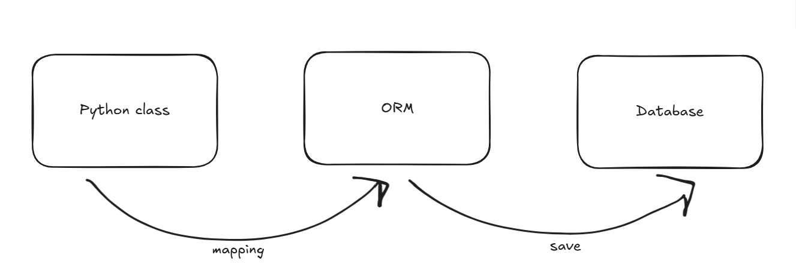
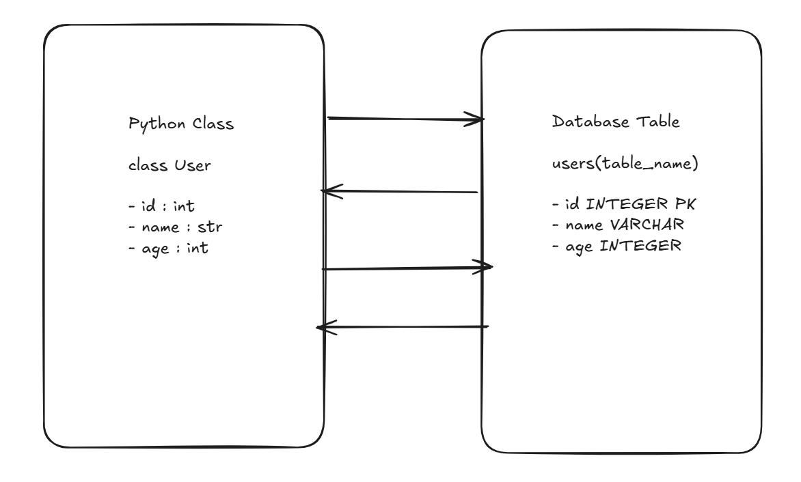
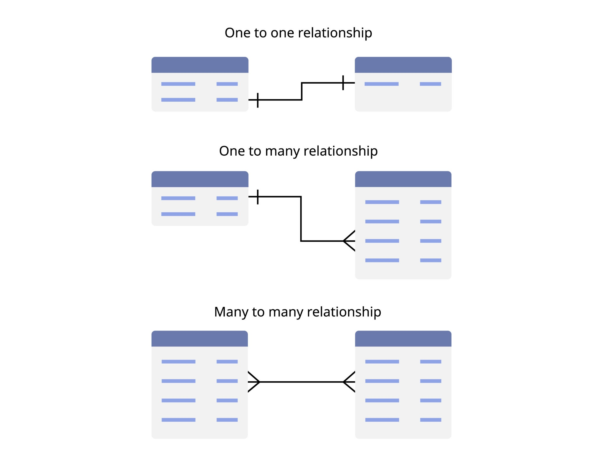

# ORM (Object-Relational Mapping)

## Temel Kavramlar
Yazılım dünyasında veriyi işleyen taraf ile veriyi saklayan taraf birbirinden tamamen farklı mantıklarla çalışır. ORM'in neden var olduğunu anlamak için bu iki dünyanın uyuşmazlığını görmek gerekir.

#### ORM'den Önce
ORM kullanılmayan durumlarda koda uzun uzun SQL metinleri yazılır.

- Kodun içi son derece karmaşıklaşır. Programlama dilinin içinde SQL sorguları metin olarak yazılır.

- Güvenlik açıkları (SQL Injection) çok yaygındır çünkü kullanıcıdan gelen veri doğrudan bu SQL metinlerine yapıştırılır.

- Veritabanı türü değiştiğinde (örneğin MySQL'den PostgreSQL'e geçildiğinde) tüm SQL metinlerini tek tek bulup yeni veritabanının diline göre değiştirmek gerekir.

#### Geleneksel İlişkisel Veritabanı Mantığı
Veritabanları veriyi Tablolar halinde tutar, Tablolar arası bağlantılar matematikseldir ve Foreign Key ile sağlanır. Veritabanının tek derdi veriyi güvenli, kurallı ve düzenli bir şekilde saklamaktır.

#### Nesne Yönelimli Programlama (OOP) Mantığı
Yazılım tarafında ise dünya Nesneler (Objects) olarak modellenir. Bir `User` nesnesi sadece yaş, isim gibi verileri tutmaz aynı zamanda listeler (örn: kullanıcının siparişleri) ve metotlar barındırır. Nesneler hafızada canlıdır ve birbiriyle doğrudan etkileşime girer.

#### Uyuşmazlık Problemi
Asıl sorun burada başlar: Bu iki dünya birbirinin dilinden anlamaz.

|Özellik|OOP|SQL|
|---|---|---|
|Veri Tutuş Şekli|Hafızada canlı, bütünleşik nesneler|Diskte düz satırlar ve sütunlar|
|İlişkiler|Doğrudan referanslar veya listeler (Örn: user.orders)|ID eşleştirmeleri (Örn: Sipariş tablosundaki UserId = 5)|
|Kalıtım|Sınıflar birbirinden miras alabilir|Tablolarda "miras alma" (kalıtım) kavramı yoktur|
|Veri Tipleri|Karmaşık veri tipleri|Sadece temel tipler|

Bir yazılımcı, OOP tarafında oluşturduğu nesneyi veritabanına kaydetmek istediğinde onu parçalara ayırıp satırlara ve sütunlara dönüştürmek zorundaydı. Geri okurken de o satırları alıp tekrar birleştirerek nesne inşa etmesi gerekiyordu. Bu parçalama ve birleştirme işlemi son derece hamallık gerektiren, hataya açık bir süreçti. Bu noktada bu hamallığı bitirecek bir çevirmene ihtiyaç duyuldu.

## ORM Nedir ve Nasıl Çalışır?

#### ORM Nedir?

ORM, koddaki nesneler ile veritabanındaki tablolar arasında çalışan otomatik bir çevirmendir. Kod yazılır, ORM arka planda bunu SQL sorgularına dönüştürür, veritabanına gönderir ve dönen cevabı yine nesnelere çevirerek sunar.

<p align="center">
  
</p>

#### Dönüşüm

|OOP|SQL|Açıklama|
|---|---|---|
|Sınıf|Tablo (Table)|Kod tarafında tasarladığın User sınıfı, veritabanında users tablosuna karşılık gelir.|
|Özellik|Sütun (Column)|Sınıfın içindeki name veya age değişkenleri, tablodaki sütun başlıkları olur.|
|Nesne|Kayıt (Row)|Sınıftan üretilen her bir canlı örnek tabloda bir satıra yazılır.|

**Mapping İşlemi Nasıl Gerçekleşir?**
1. Yapılandırma (Configuration): ORM aracına hangi sınıfın hangi tabloya denk geldiği belirtilir. Bu eşleştirme genellikle kod içindeki etiketlerle (Data Annotations) veya yapılandırma fonksiyonlarıyla yapılır.

2. Sorgu Çevirisi (Translation): Koda nesne tabanlı bir sorgu yazıldığında ORM bu ifadeyi analiz eder ve veritabanının anlayacağı şekilde SQL metnine dönüştürür.

3. Çalıştırma: Üretilen SQL sorgusu, uygun veritabanı sürücüsü üzerinden veritabanına iletilir.

4. Nesneye Dönüştürme (Hydration / Materialization): Veritabanından dönen tablo formatındaki ham veriler, ORM tarafından alınır ve önceden tanımlanan sınıfların yeni örneklerine (nesnelere) doldurulur. İşlem sonunda elde SQL satırları değil, doğrudan kodda kullanılabilecek objeler listesi olur.

<p align="center">
  
</p>

Veritabanına gidip manuel olarak tablo oluşturmak yerine, projenin "Model" katmanında sınıflar yazılır. ORM, bu sınıfları okuyup veritabanı tablolarını otomatik olarak inşa eder, buna Schema Generation (Şema Üretimi) denir. Proje ilerledikçe bu tablolara yeni sütunlar eklemek, tiplerini değiştirmek veya silmek gerektiğinde ise, ORM bu yapısal değişiklikleri adım adım kaydeder ve veritabanına bir tarihçeyle uygular. Veritabanı yapısını versiyonlama ve güvenle güncelleme işlemine ise Migration adı verilir.

Örneğin Python'da (SQLAlchemy gibi bir kütüphane ile) tablo kodla şu şekilde modellenir:

```Python
class User(Base):
    __tablename__ = 'users' # Tablonun adı
    
    id = Column(Integer, primary_key=True) # Sütun 1: Kimlik numarası
    name = Column(String)                  # Sütun 2: İsim
    age = Column(Integer)                  # Sütun 3: Yaş
```

Artık yeni bir kullanıcı eklemek için SQL yazmak yerine, sadece bir nesne oluşturup ORM'e "bunu kaydet" demek yeterlidir: `new_user = User(name="Ali", age=25)`.

#### Avantajlar ve Dezavantajlar

- Hız ve Üretkenlik (Avantaj): Uzun SQL metinleri yazmak, bunları test etmek ve hata ayıklamakla uğraşılmaz. Geliştirme süreci ciddi oranda hızlanır.

- Güvenlik (Avantaj): ORM'ler, verileri SQL sorgusuna dönüştürürken zararlı girişleri otomatik olarak temizler (Parametrik sorgular kullanır). Bu sayede "SQL Injection" saldırılarının önüne geçilmiş olur.

- Veritabanı Bağımsızlığı (Avantaj): Temel SQL standart olsa da, her veritabanının (MySQL, PostgreSQL, Oracle vb.) sayfalama, tarih işlemleri veya metin birleştirme gibi konularda kendine has bir "şivesi" (dialect) vardır. Uygulamanın veritabanı değiştiğinde koddaki tüm çıplak SQL metinlerini yeni veritabanının şivesine göre baştan yazmak gerekir. ORM kullanıldığında ise sadece yapılandırma dosyasındaki bir satır değiştirilir ve ORM, yeni veritabanının söz dizimine anında uyum sağlar.

- Performans Kaybı (Dezavantaj): Kodun SQL'e çevrilmesi ekstra bir işlem adımıdır. Çok yoğun veri çekilen, aşırı karmaşık raporlama sorgularında ORM'in ürettiği SQL, bir insanın elle yazacağı optimize edilmiş SQL'den daha yavaş çalışabilir.

- Kontrol Kaybı (Dezavantaj): Arka planda tam olarak hangi SQL sorgularının çalıştığı görülemediği için sistem büyüdüğünde farkında olmadan veritabanını yoran verimsiz işlemler yapılabilir.

## Temel Mimari Kalıplar
ORM araçları arka planda veritabanıyla konuşurken ağırlıklı olarak iki farklı felsefeden (mimari kalıptan) birini benimser. Hangi dilde olduğu fark etmeksizin kullanılacak ORM kütüphanesi bu iki yaklaşımdan birine uyacaktır.

#### 1. Active Record

Bu yaklaşımda oluşturulan sınıf (nesne), doğrudan veritabanı işlemlerini yapabilme yeteneğine sahiptir. Nesnenin içinde .save(), .delete() veya .update() gibi metotlar hazır gelir.

- Mantık: Nesne, veritabanı tablosunun birebir aynasıdır ve kendini nasıl kaydedeceğini bilir.

- Kullanım Alanı: Hızlı geliştirme süreçlerinde, startup projelerinde ve standart CRUD (Ekle, Oku, Güncelle, Sil) işlemlerinde çok etkilidir.

- Popüler Örnekler: Django ORM (Python), Eloquent (Laravel/PHP), Ruby on Rails.

```Python
# Active Record Örneği
user = User(name="Ali", age=28)
user.save() # Nesne doğrudan veritabanıyla konuşur ve kendini kaydeder.
```

#### 2. Data Mapper

Data Mapper yaklaşımında nesne, sadece ve sadece veriyi tutar. Veritabanının varlığından bile haberi yoktur. Nesneyi veritabanına kaydetmek, güncellemek veya silmek tamamen ayrı bir "Yönetici" (Session, EntityManager veya Context) sınıfının sorumluluğundadır.

- Mantık: İş kuralları (nesne) ile veritabanı işlemleri (mapper) birbirinden tamamen yalıtılmıştır. Nesne sadece işini yapar, onu veritabanına kaydetmek "Yönetici"nin işidir. 

- Kullanım Alanı: Karmaşık iş kurallarının olduğu, büyük ölçekli ve uzun ömürlü kurumsal projelerde tercih edilir.

- Neden kullanılır? Sistem devasa boyutlara ulaştığında işlerin karışmasını engeller. Veritabanı kodları ile iş kuralları birbirine karışmadığı için proje temiz kalır.

- Popüler Örnekler: SQLAlchemy (Python), Entity Framework (C#), Hibernate (Java).

```Python
# Data Mapper Örneği
user = User(name="Ayşe", age=35)

# Nesne kendini kaydedemez, aracı bir yöneticiye (session) ihtiyaç duyar:
session.add(user)
session.commit()
```

#### Temel Farklar

|Özellik|Active Record|Data Mapper|
|---|---|---|
|Bağımlılık|Model veritabanına sıkı sıkıya bağlıdır.|Model veritabanından tamamen bağımsızdır.|
|Öğrenme Eğrisi|Çok daha düşük, başlaması kolaydır.|Daha dik, ekstra kavramlar gerektirir.|
|Mimari|Tek Sorumluluk (SRP) ilkesini biraz esnetir.|Katı bir şekilde ayrım yapar, kod daha temiz kalır.|

## Temel Veritabanı İşlemleri (CRUD)
CRUD (Create, Read, Update, Delete) bir uygulamanın veritabanıyla yaptığı dört temel işlemin kısaltmasıdır. Data Mapper mantığını kullanarak, hiç SQL yazmadan bu işlemlerin Python'da (SQLAlchemy kütüphanesi tarzıyla) nasıl yapıldığına bakalım.

#### 1. Create (Ekleme)
Yeni bir kayıt eklemek için önce normal bir Python nesnesi oluşturulur, ardından bu nesne veritabanına kaydetmesi için aracıya (session) teslim edilir.

```Python
# Sadece hafızada yaşayan bir nesne (kullanıcı)
new_user = User(name="Ali", age=25)

# Veritabanına ekle komutu
session.add(new_user)

# İşlemi onaylayıp kalıcı hale getir
session.commit()
```

#### 2. Read (Okuma)
Veri okumak, ORM'in en güçlü olduğu yerlerden biridir. Tablodan satırları çekmek yerine, doğrudan nesneleri filtreleyerek getirir.

```Python
from sqlalchemy import select

# Tablodaki tüm kayıtları bir liste olarak getirir
all_users = session.execute(select(User)).scalars().all()

# Belirli bir şarta göre filtreleme (WHERE sorgusu yerine geçer)
adult_users = session.execute(select(User).where(User.age >= 18)).scalars().all()

# Sadece tek bir kişiyi bulma
ali = session.execute(select(User).where(User.name == "Ali")).scalar_one_or_none()
if ali:
    print(ali.age)
```

#### 3. Update (Güncelleme)
ORM'de güncelleme yapmak son derece doğaldır. Önce güncellenecek veri veritabanından bulunur, normal bir Python değişkenini değiştirir gibi değeri değiştirilir ve işlem onaylanır.

```Python
from sqlalchemy import select

# Önce güncellenecek kişiyi bul
user_to_update = session.execute(select(User).where(User.name == "Ali")).scalar_one_or_none()

if user_to_update:
    # Nesnenin özelliğini değiştir (UPDATE sorgusuna dönüşür)
    user_to_update.age = 30
    
    # Değişiklikleri kaydet
    session.commit()
```

#### 4. Delete (Silme)
Silme işlemi de güncellemeyle aynı mantıkta çalışır. Nesne bulunur ve aracıdan onu silmesi istenir.

```Python
from sqlalchemy import select

# Silinecek kişiyi bul
user_to_delete = session.execute(select(User).where(User.name == "Ali")).scalar_one_or_none()

if user_to_delete:
    # Veritabanından sil komutunu ver
    session.delete(user_to_delete)
    
    # İşlemi onayla
    session.commit()
```

## Tablolar Arası İlişkiler
Veritabanında tablolar birbirine Foreign Key denilen ID'ler üzerinden bağlanır. ORM, bu karmaşık ID eşleştirmelerini gizleyerek ilişkilerin doğrudan nesneler ve listeler üzerinden yönetilmesini sağlar.

<p align="center">
  
</p>

#### Bire-Bir (One-to-One)
Her kaydın diğer tabloda sadece tek bir karşılığı vardır.

- Örnek: Bir `User`ın sadece bir tane `Profile` detayı olabilir, bir profil de sadece bir kullanıcıya ait olabilir.

- Kod Mantığı: Kullanıcı nesnesinin içine tek bir profil nesnesi yerleştirilir.

```Python
# Kullanıcının profili doğrudan çağırılabilir
print(user.profile.bio)
```

#### Bire-Çok (One-to-Many)
Bir kaydın diğer tabloda birden fazla karşılığı olabilir.

- Örnek: Bir `User`ın birden fazla `Post`u olabilir.

- Kod Mantığı: Kullanıcı sınıfının içine gönderilerin tutulacağı bir liste koyulur. SQL tarafında gönderiler tablosuna "User ID" sütunu eklenir ama ORM bunu bir Python listesi olarak sunar.

```Python
# Kullanıcının yeni gönderisi listeye ekler gibi veritabanına eklenir
new_post = Post(title="My first blog post")
user.posts.append(new_post)

session.commit()
```

#### Çoka-Çok (Many-to-Many) ve Ara Tablolar
Her iki taraftaki kayıtlar birbirinin çoklu karşılığı olabilir.

- Örnek: Bir `User`ın birden fazla `Role`ü olabilir; bir `Role`ü de birden fazla `User` alabilir.

- Ara Tablo Mantığı: İlişkisel veritabanları bu yapıyı doğrudan kuramaz. Araya sadece eşleştirmeleri tutan üçüncü bir tablo oluşturulmak zorundadır.

- ORM'in Avantajı: ORM bu ara tabloyu arka planda kendi yönetir. Kod yazılırken sanki ara tablo yokmuş gibi davranılır.

```Python
# Kullanıcıyı bul ve rolü kullanıcının listesine ekle
user.roles.append(admin_role)

session.commit()
# ORM arka planda otomatik olarak ara tabloya kayıt atar.
```

## Performans ve İleri Düzey Konular

Veritabanına doğrudan SQL yazılmadığı için, arka planda kaç tane sorgu çalıştığı fark edilmez. Bu durum ORM'de bir problem ortaya çıkarır: N+1 Problemi.
Bu problemi anlamak için önce ORM'in verileri yükleme stratejilerini bilmek gerekir.

#### Lazy Loading (Tembel Yükleme)
ORM'in varsayılan davranışıdır. Bir nesne veritabanından çekildiğinde, onunla ilişkili olan diğer verileri o an getirmez. Ancak kodun içinde o ilişkili veri çağrılırsa (nokta koyup ismi yazılırsa), ORM lazım olduğunu anlar ve veritabanına gidip yeni bir sorgu atar.

- Avantajı: İhtiyaç olmayan veriyi çekmeyerek hafızayı korur.

#### Eager Loading (Hevesli Yükleme)
Ana nesneyi çekerken, onunla ilişkili verileri de baştan, tek seferde getiren yöntemdir (Arka planda SQL JOIN komutunu kullanır).

- Avantajı: Veritabanına tekrar tekrar gitmeyi engeller.

#### N+1 Sorgu Problemi

Diyelim ki sistemimizde 100 tane `User` (kullanıcı) var ve her kullanıcının da gönderileri (posts) var. Tüm kullanıcıların isimlerini ve yazdıkları gönderilerin başlıklarını ekrana yazdırmak istiyoruz.

Hatalı Kod (N+1 Problemi):
```Python
users = session.query(User).all() 
for user in users:
    for post in user.posts: 
        print(f"{user.name} - {post.title}")
```

>100 kullanıcı için önce 1 kez kullanıcılar çekildi, sonra döngü içinde 100 kez gönderileri çekildi, toplamda 101 tane SQL sorgusu çalıştı.

**Çözüm: Eager Loading Kullanmak**

ORM'e, ilişkili verileri baştan getirmesi söylenmeli.

```Python
session.execute(select(User).options(joinedload(User.posts))).unique().scalars().all()
for user in users:
    for post in user.posts:
        print(f"{user.name} - {post.title}")
```

> Sadece bir kelime eklemek 101 sorguyu tek bir sorguya düşürdü. ORM kullanırken performansın altın kuralı her zaman arka planda kaç sorgu çalıştığını izlemektir.

#### Bulk Insert ve Zaman Serisi Verileri
Standart CRUD işlemleri için session.add() ve session.commit() kullanımı idealdir. Ancak bir sistem saniyede yüzlerce veri üretiyorsa (örneğin IoT sensörleri, telemetri veya log kayıtları), her bir kayıt için ayrı ayrı veritabanına bağlanıp işlem onayı beklemek büyük bir I/O darboğazı yaratır ve sistemi kilitler. ORM'in nesne oluşturma ve takip etme (tracking) maliyeti yüksek frekanslı işlemlerde performansı çökertir.

Böyle durumlarda nesneleri tek tek kaydetmek yerine toplu ekleme (Bulk Insert) yöntemleri kullanılır:

- Bulk Save: ORM nesneleri bir listeye toplanır ve tek bir seferde veritabanına gönderilir (örn. SQLAlchemy'de `session.bulk_save_objects(liste)`). Bu yöntem nesne takip mekanizmalarını atlayarak büyük bir hız kazandırır.

- ORM'i Devreden Çıkarmak: Zaman serisi verilerinde hız her şeyden önemliyse, ORM katmanı tamamen bypass edilip kütüphanenin "Core" düzeyine inilerek (doğrudan SQL çalıştırarak) veriler işlenmelidir.

#### Asenkron (Non-Blocking) Mimari
Veritabanı işlemleri doğası gereği ağ (network) üzerinden gerçekleşir ve zaman alır. Senkron bir mimaride session.commit() komutu çağrıldığında, veritabanı veriyi diske yazıp "işlem başarılı" cevabı dönene kadar kod o satırda kilitlenir (bloklanır). Gecikmeye tahammülü olmayan, ana döngünün kesintisiz akması gereken gerçek zamanlı sistemlerde bu bloklanma kabul edilemez.

Bu kilidi kırmak için iki temel yaklaşım kullanılır:

1. Asenkron ORM (Async I/O): Modern ORM kütüphaneleri asenkron yapıları destekler (Örn: SQLAlchemy AsyncSession). Veritabanına istek atılır ve cevap beklenirken program başka işleri yapmaya (event loop üzerinden) devam eder.

2. Kuyruk Mimarisi (Message Queue): Veritabanı kayıt işlemleri ana programdan tamamen koparılır. Ana program veriyi sadece bir kuyruğa (Redis, RabbitMQ veya basit bir Thread) fırlatıp kendi işine devam eder. Arka planda çalışan ayrı bir iş parçacığı bu kuyruktaki verileri toplayıp veritabanına yazar.
