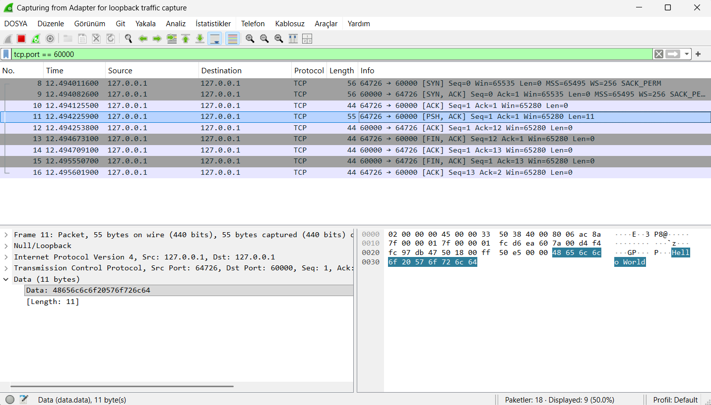
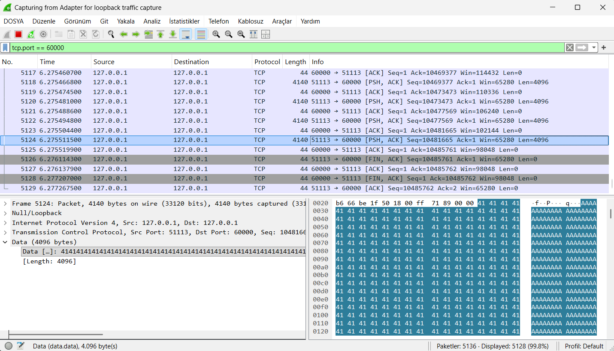

# TCP/IP ve Soket Programlama Trafik Analizi

## 1. Proje Özeti
Bu projede, C++ ve Winsock2 kütüphanesi kullanılarak temel bir İstemci-Sunucu (Client-Server) mimarisi tasarlanmıştır. Proje üç ana bileşenden oluşmaktadır:
1. **Server (Sunucu):** Belirlenen port üzerinden (Port: 60000) gelen TCP bağlantılarını dinler, veriyi teslim alır ve toplam alınan veri boyutunu ekrana yazdırır.
2. **Client - Hello World:** Sunucuya bağlanıp 11 byte boyutunda "Hello World" mesajını ileten ve bağlantıyı sonlandıran temel istemci.
3. **Client - 10 MB:** Sunucuya 10 MB (10.485.760 byte) boyutunda sahte veriyi (payload) 4 KB'lık (4096 byte) parçalar halinde gönderen ve performansı test eden istemci.

Testler aynı bilgisayar üzerinde, **"Loopback (127.0.0.1)"** arayüzü kullanılarak gerçekleştirilmiş ve Wireshark üzerinden ağ paketleri analiz edilmiştir.

---

## 2. Wireshark Katman Analizi (TCP/IP Modeline Göre)

İletişim sürecinde yakalanan paketler 4 katmanlı TCP/IP referans modeline göre aşağıdaki gibi incelenmiştir:

### 2.1. Uygulama Katmanı (Application Layer)
C++ kodları bu katmanda (`send` ve `recv` fonksiyonları) faaliyet gösterir. 
- **Hello World Testi:** Uygulama katmanı tam olarak 11 byte uzunluğunda string verisini ("Hello World") taşıma katmanına iletmiştir.
- **10 MB Testi:** Kod tarafında belirlenen `chunkSize = 4096` parametresi ile 10 MB'lık veri, 2560 adet 4 KB'lık döngülerle alt katmana aktarılmıştır.

### 2.2. Taşıma Katmanı (Transport Layer)
İletişimin TCP protokolü ile 60000 portu üzerinden sağlandığı bu katman, Wireshark analizinin odak noktasıdır. Süreç üç aşamada gerçekleşmiştir:

**A. Bağlantı Kurulumu (3-Way Handshake)**
- **[SYN]:** İstemci bağlantı talebi gönderir.
- **[SYN, ACK]:** Sunucu talebi aldığını ve onayladığını bildirir.
- **[ACK]:** İstemci onayı aldığını belirtir ve kanal veri aktarımına açılır.

**B. Veri Aktarımı (Data Transfer & Segmentation)**
- İstemciden gelen paketlerde **[PSH, ACK]** bayrakları görülür (Push: Veriyi hemen uygulamaya ilet).
- 10 MB'lık aktarımda Wireshark'ta görülen **4140 Byte**'lık paket uzunluğunun matematiği şu şekildedir: 
	4096 Byte (Uygulama Payload) + 24 Byte (TCP Başlığı) + 20 Byte (IPv4 Başlığı) = Toplam 4140 Byte çerçeve boyutu.
- TCP'nin güvenilirlik ilkesi gereği, sunucuya ulaşan her veri paketi için sunucudan istemciye bir **[ACK]** (Onay) paketi (44 Byte) döndüğü gözlemlenmiştir. 
- Toplam 2560 veri paketi ve 2560 onay paketi ile ~5130 satırlık kusursuz bir haberleşme trafiği kaydedilmiştir.

**C. Bağlantı Sonlandırma (4-Way Teardown)**
- İletişim bittiğinde sırasıyla **[FIN, ACK]** (İstemci bitirdi) -> **[ACK]** (Sunucu onayladı) -> **[FIN, ACK]** (Sunucu da soketi kapattı) -> **[ACK]** (İstemci onayladı) paketleri ile soketler güvenli bir şekilde kapatılmıştır.

### 2.3. İnternet Katmanı (Internet Layer)
- Paketlerde IP protokolü olarak IPv4 kullanılmıştır.
- Kaynak (Source) ve Hedef (Destination) adreslerinin her ikisi de **127.0.0.1** (Localhost) olarak kaydedilmiştir. Hedefe IP üzerinden yönlendirme bu katmanda yapılmıştır.

### 2.4. Ağ Erişim Katmanı (Network Access)
- İletişim fiziksel bir ağ kartı (Ethernet/Wi-Fi) üzerinden değil, sanal bir arayüz üzerinden yapıldığı için standart bir MAC adresi veya Ethernet çerçevesi yerine Wireshark'ta **Null/Loopback** arayüzü başlıkları gözlemlenmiştir.

## 3. Senaryo 1: "Hello World" İletimi

Bu senaryoda `client_hello.cpp` çalıştırılmış ve Wireshark üzerinden `tcp.port == 60000` filtresiyle izleme yapılmıştır. Toplam süreç 3 ana faza ayrılır:

### A. TCP 3-Way Handshake (Bağlantı Kurulumu)
Koddaki `connect()` fonksiyonu çağrıldığında uygulama katmanında veri henüz yoktur ancak taşıma katmanında şu paketler oluşur:
1. **[SYN]:** İstemci, sunucuya rastgele bir Sequence Number (Örn: 0) ile bağlanma isteği gönderir.
2. **[SYN, ACK]:** Sunucu (`accept()` fonksiyonunda beklerken) bu isteği alır, istemcinin Sequence numarasını 1 artırıp onaylar (ACK) ve kendi SYN paketini yollar.
3. **[ACK]:** İstemci, sunucunun SYN paketini onaylar. Bağlantı kurulmuştur.

### B. Veri İletimi (Data Transfer)
`send(clientSocket, message, ...)` fonksiyonu çağrıldığında:
- Wireshark'ta **[PSH, ACK]** bayraklarına sahip bir paket görülür. PSH (Push) bayrağı, alıcı TCP'sine bu veriyi beklemeden hemen Uygulama Katmanına (C++ `recv()` fonksiyonuna) iletmesini söyler.
- Packet Details sekmesinde "Data" veya "Payload" bölümüne bakıldığında **11 byte** uzunluğundaki "Hello World" açık metin (Cleartext) olarak okunabilir.

### C. Bağlantının Kapatılması (TCP Teardown)
`closesocket()` çağrıldığında 4-Way Handshake (veya 3-Way FIN) başlar:
1. **[FIN, ACK]:** İstemci veri gönderimini bitirdiğini belirtir.
2. **[ACK]:** Sunucu bunu onaylar.
3. **[FIN, ACK]:** Sunucu da kendi soketini kapattığını (`closesocket(serverSocket)`) bildirir.
4. **[ACK]:** İstemci onaylar ve süreç biter.

  

---

## 4. Senaryo 2: 10 MB Veri İletimi

Bu senaryoda `client_10mb.cpp` çalıştırılmış ve taşıma katmanının büyük verilerle nasıl başa çıktığı gözlemlenmiştir.

### TCP Segmentasyon ve MSS
Uygulama katmanımızda tek bir kerede 4096 byte (4 KB) veriyi `send()` fonksiyonuna veriyoruz. Ancak Loopback arayüzünün Maximum Segment Size (MSS) sınırlarına veya MTU değerlerine göre TCP bu veriyi daha küçük parçalara (Segment) ayırarak gönderir.
- Wireshark'ta arka arkaya çok sayıda **[ACK]** bayraksız veya sadece **[ACK]** taşıyan, veri dolu TCP paketleri görürsünüz.
- Hedef taraf, aldığı parçaları sıraya dizmek için **Sequence Number** (Sıra Numarası) değerini sürekli alınan byte kadar artırır. 

### TCP Window Size ve Akış Kontrolü
Wireshark kolonlarında `Win=` şeklinde bir değer göreceksiniz.
- 10 MB gibi büyük bir dosya aktarılırken, sunucunun belleği (TCP Receive Buffer) dolmaya başlarsa, sunucu gönderdiği ACK paketlerinde `Window Size` değerini düşürür.
- Bu sayede sunucu, istemciye "Biraz yavaşla, verileri işleyemiyorum" mesajı verir (Akış Kontrolü). Localhost üzerinde çok hızlı gerçekleştiği için bu değerin sıfıra inmesi (Zero Window) pek beklenmez ancak TCP'nin güvenilir (Reliable) aktarım yapısının en güzel kanıtıdır.

  

## 5. Sonuç ve Gözlemler
- Uygulama katmanında (C++) bir String veya Vector olarak gördüğümüz verilerin, ağ katmanlarında nasıl parçalandığını ve başlıklar (Headers) eklenerek (Ethernet + IP + TCP) büyüdüğünü gözlemledik.
- Yazdığımız soketlerde şifreleme (TLS/SSL) olmadığı için Wireshark'ta tüm payload'un düz metin (Plaintext) okunabildiği teyit edilmiştir. Güvenli iletişim için bu yapının üzerine Uygulama Katmanında veya Sunum Katmanında şifreleme katılması gerektiği kanıtlanmıştır.